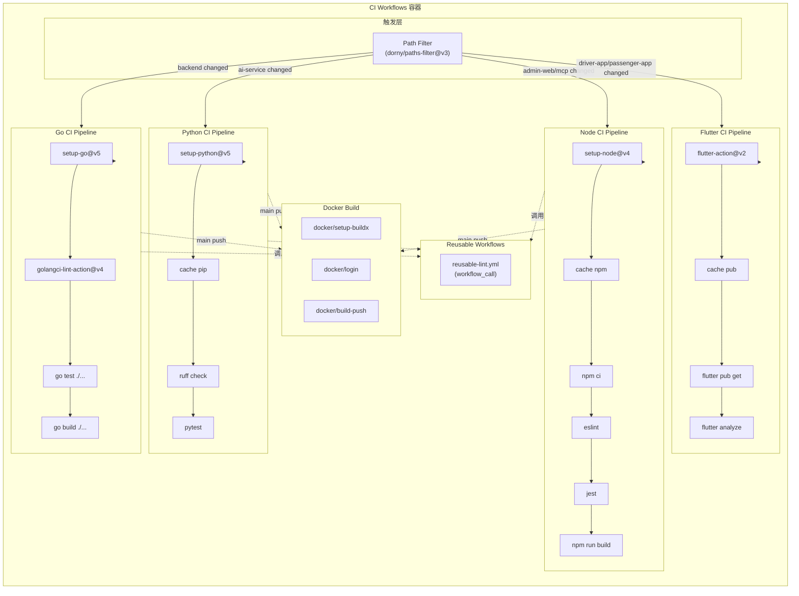

# C4 Level 3 — 组件

> 分解最复杂的容器：**CI Workflows**（多语言 CI/CD 流水线）

## 组件清单（CI Workflows 容器）

| 组件 | 技术 | 职责 |
|------|------|------|
| Path Filter | `dorny/paths-filter@v3` | 检测变更的服务目录，决定是否触发对应 workflow |
| Go CI Pipeline | `actions/setup-go@v5` + `golangci-lint` | ride-hermes 服务的 lint → test → build 流水线 |
| Python CI Pipeline | `actions/setup-python@v5` + `ruff` + `pytest` | ai-service 的 lint → test → build 流水线 |
| Node CI Pipeline | `actions/setup-node@v4` + `npm ci` | admin-web / mcp 的 lint → test → build 流水线 |
| Flutter CI Pipeline | `subosito/flutter-action@v2` | driver-app / passenger-app 的 analyze → build 流水线 |
| Dependency Cache | `actions/cache@v4` | 缓存 Go modules / pip / npm / pub 依赖，减少构建时间 |
| Docker Build | `docker/build-push-action@v5` | 构建并推送全服务 Docker 镜像（main push 触发） |
| Reusable Lint | `workflow_call` | 提取公共 lint 逻辑，减少 workflow 间重复 |

## 组件图（CI Workflows 分解）



## 组件详细设计

### Path Filter 组件

```yaml
# .github/workflows/ci.yml 中的 paths-filter 配置
- uses: dorny/paths-filter@v3
  id: changes
  with:
    filters: |
      backend:
        - 'src/ride-hermes/**'
      ai-service:
        - 'src/ai-service/**'
      admin-web:
        - 'src/admin-web/**'
      mobile:
        - 'src/driver-app/**'
        - 'src/passenger-app/**'
      mcp:
        - 'src/ride-hermes-mcp/**'
      docker:
        - 'src/docker-compose.yml'
        - '**/Dockerfile'
```

### Go CI Pipeline 组件

```yaml
# ci-backend.yml 核心步骤
- uses: actions/setup-go@v5
  with:
    go-version: '1.22'
- uses: golangci/golangci-lint-action@v4
  with:
    working-directory: src/ride-hermes
- run: cd src/ride-hermes && go test -race -coverprofile=coverage.out ./...
- run: cd src/ride-hermes && go build ./...
```

### Python CI Pipeline 组件

```yaml
# ci-ai-service.yml 核心步骤
- uses: actions/setup-python@v5
  with:
    python-version: '3.12'
- uses: actions/cache@v4
  with:
    path: ~/.cache/pip
    key: ${{ runner.os }}-pip-${{ hashFiles('src/ai-service/requirements.txt') }}
- run: cd src/ai-service && pip install -r requirements.txt
- run: cd src/ai-service && ruff check .
- run: cd src/ai-service && pytest --cov --cov-report=xml
```

### Dependency Cache 组件

| 服务 | 缓存路径 | key 模式 |
|------|----------|----------|
| Go | `~/go/pkg/mod` | `${{ runner.os }}-go-${{ hashFiles('**/go.sum') }}` |
| Python | `~/.cache/pip` | `${{ runner.os }}-pip-${{ hashFiles('**/requirements.txt') }}` |
| Node | `~/.npm` | `${{ runner.os }}-npm-${{ hashFiles('**/package-lock.json') }}` |
| Flutter | `~/.pub-cache` | `${{ runner.os }}-pub-${{ hashFiles('**/pubspec.lock') }}` |

## 组件间依赖

| 组件 | 依赖 | 说明 |
|------|------|------|
| Go/Python/Node/Flutter CI | Path Filter | 由路径过滤结果决定是否执行 |
| Docker Build | Go/Python/Node CI | 仅在 CI 通过后构建镜像 |
| Reusable Lint | Go/Python/Node CI | 被各 CI pipeline 调用 |
| Dependency Cache | 各 CI Pipeline | 嵌入各 pipeline 的 setup 步骤 |

## 关键设计决策

1. **每服务独立 workflow**（而非单一 monolith workflow）
   - 理由：独立失败、独立重试、独立缓存
   - 替代方案：单一 workflow + matrix → 失败时全量重跑

2. **paths-filter 前置判断**
   - 理由：避免无关变更触发全量构建，节省 Actions 分钟
   - 替代方案：每个 workflow 自带 `paths` 过滤 → 无法跨 workflow 共享判断结果

3. **Reusable Workflows 提取公共逻辑**
   - 理由：减少 5 个 workflow 间的重复配置
   - 替代方案：Composite Actions → 粒度太细，不适合跨 workflow 复用

4. **缓存策略：hashFiles 作为 key**
   - 理由：依赖文件变更时自动失效缓存
   - 替代方案：时间戳 key → 缓存命中率低
