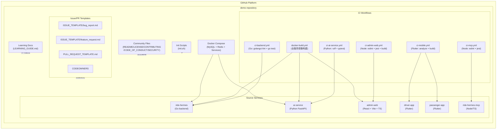

# C4 Level 2 — 容器

## 容器清单

| 容器 | 技术 | 职责 |
|------|------|------|
| Community Files | Markdown | 社区健康文件（README、LICENSE、CONTRIBUTING、CODE_OF_CONDUCT、SECURITY）— 仓库的"门面"和信任基础 |
| CI Workflows | GitHub Actions (YAML) | 多语言 CI/CD 流水线 — 每服务独立 workflow，路径过滤触发 |
| Issue/PR Templates | Markdown + YAML | 标准化贡献流程 — Issue 模板（bug/feature）、PR 模板、CODEOWNERS |
| Source Services | Go / Python / Node / Flutter / TS | 6 个业务服务 — 作为 CI/CD 的构建目标和学习示例 |
| Docker Compose | Docker + YAML | 本地开发环境编排 — MySQL 8.0 + Redis 7.2 + 后端服务 |
| Init Scripts | Bash (init.sh) | 模板初始化 — 替换项目名称、作者、描述等变量 |
| Learning Docs | Markdown | 学习指南 — 每个 GitHub 功能的说明文档和使用路径 |

## 容器图

## 容器间关系

| 源容器 → 目标容器 | 关系 | 说明 |
|-------------------|------|------|
| CI Workflows → Source Services | builds/tests | 每个 workflow 针对对应服务的代码变更 |
| Docker Compose → Source Services | orchestrates | 本地开发时编排服务依赖 |
| Init Scripts → Repository | initializes | 模板化后替换项目变量 |
| Community Files → Repository | documents | 提供项目概述和贡献规范 |
| Learning Docs → Repository | educates | 引导用户学习 GitHub 功能 |

## ADR 映射

| ADR | 影响的容器 |
|-----|-----------|
| ADR-001（源仓库处理策略） | Source Services |
| ADR-002（学习模板定位） | Community Files, Learning Docs |
| ADR-003（技术栈选择）⚠️ 需更新 | Source Services, CI Workflows |
| ADR-004（中文文档） | Community Files, Learning Docs |
| ADR-005（功能模块化布局） | 全部容器 |
| ADR-006（多语言 CI 策略）🆕 | CI Workflows |
